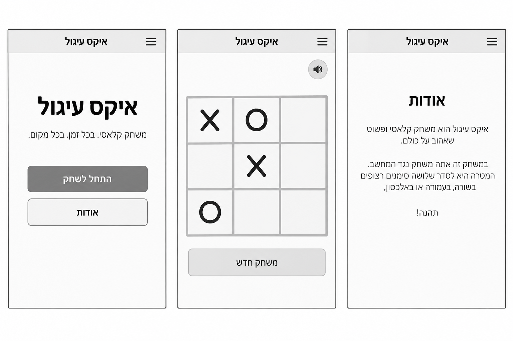
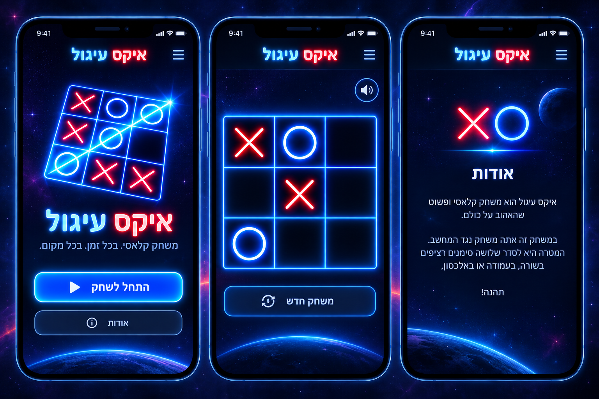
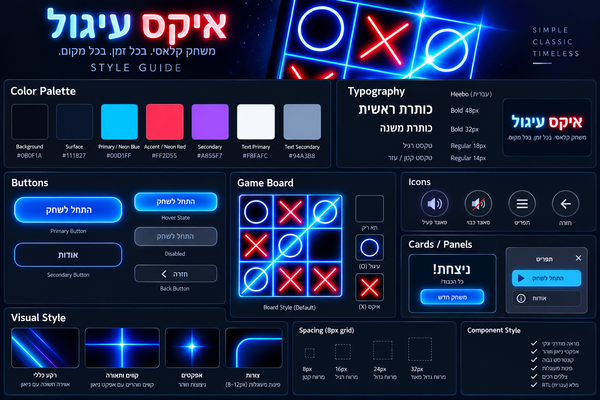

# Design (UI / UX) — איקס עיגול

מסמך זה מתאר את מבנה המסכים והשפה העיצובית של אפליקציית **„איקס עיגול”**.

המסמך נשען על שלוש תמונות הייחוס של הפרויקט:

## Wireframes — מבנה ופריסת המסכים

## Mockups — המראה הסופי של המסכים

## Style Guide — השפה העיצובית

---

# 1. Screens

## מסך הבית

### מטרה
להציג למשתמש את המשחק ולאפשר לו להתחיל לשחק או לעבור למסך האודות.

### מה יש במסך
- כותרת המשחק: **„איקס עיגול”**.
- תיאור קצר של המשחק.
- המחשה חזותית של לוח איקס־עיגול.
- כפתור ראשי: **„התחל לשחק”**.
- כפתור משני: **„אודות”**.
- תפריט ניווט זמין בחלק העליון של המסך.

### מה קורה במסך
- לחיצה על **„התחל לשחק”** מעבירה למסך המשחק.
- לחיצה על **„אודות”** מעבירה למסך האודות.
- תפריט הניווט מאפשר מעבר בין בית, משחק ואודות.

---

## מסך המשחק

### מטרה
לאפשר למשתמש לשחק משחק איקס־עיגול מלא מול המחשב.

### מה יש במסך
- כותרת המשחק בחלק העליון.
- תפריט ניווט.
- כפתור השתקה / הפעלת שמע.
- לוח משחק בגודל 3×3.
- סימני **X** ו־**O** מוצגים בסגנון ניאון.
- כפתור **„משחק חדש”**.
- הודעת תוצאה כאשר המשחק מסתיים.

### מה קורה במסך
- המשתמש תמיד משחק כ־**X** ומבצע את המהלך הראשון.
- לחיצה על תא פנוי מציבה בו X.
- לאחר מהלך המשתמש, הלוח נחסם למשך כחצי שנייה.
- לאחר ההשהיה המחשב מבצע את המהלך שלו כ־O.
- לא ניתן ללחוץ על תא תפוס.
- לא ניתן לבצע מהלך נוסף בזמן תור המחשב.
- אם המשתמש מנצח, המחשב מנצח או מתקבל תיקו, מוצגת הודעה מתאימה.
- במקרה של ניצחון, שלושת התאים המנצחים מודגשים.
- לאחר סיום המשחק הלוח נשאר במצבו הסופי.
- לחיצה על **„משחק חדש”** מאפסת את הלוח ומתחילה משחק חדש.
- מעבר למסך אחר במהלך משחק מאפס את המשחק הנוכחי.
- כפתור השמע משתיק או מפעיל מחדש את האפקטים הקוליים.

---

## מסך אודות

### מטרה
להציג מידע קצר על המשחק ועל מי שפיתח אותו.

### מה יש במסך
- כותרת: **„אודות”**.
- טקסט קצר המתאר את המשחק.
- טקסט קרדיט:
  **„פותח על ידי תלמידי ג'ון ברייס התותחים”**.
- אלמנט חזותי של X ו־O.
- תפריט ניווט בחלק העליון.

### מה קורה במסך
- המשתמש קורא את המידע על המשחק.
- באמצעות התפריט ניתן לחזור למסך הבית או לעבור למסך המשחק.

---

## ניווט בין המסכים

האפליקציה כוללת שלושה מסכים עיקריים:

**בית → משחק → אודות**

הניווט זמין מכל מסך באמצעות תפריט קבוע.

כללי הניווט:
- מעבר ממסך הבית למשחק מתחיל משחק חדש.
- מעבר ממסך המשחק למסך אחר מאפס את המשחק.
- חזרה למסך המשחק מציגה לוח חדש.
- אין שמירת מצב משחק בין המסכים.

---

# 2. Style Guide

## כיוון כללי

השפה החזותית מבוססת על אווירת **חלל עתידנית עם ניאון**, בהתאם ל־Inspiration Board ול־Mockups.

העיצוב משלב:
- רקעים כהים מאוד.
- כחול ניאון בוהק.
- אדום ניאון.
- סגול כאזור צבע משלים.
- אור, זוהר ו־Glow סביב רכיבים חשובים.
- מראה משחקי, מודרני וברור.

העיצוב צריך להישאר נקי ולא עמוס, כך שהמשחק עצמו יישאר מוקד תשומת הלב.

---

## צבעים עיקריים

### Background
- **#0B0F1A** — רקע כהה ראשי.

### Surface
- **#111827** — משטחים, כרטיסים ואזורים מוגדרים.

### Primary / Neon Blue
- **#00D1FF** — צבע הפעולה הראשי, מסגרות זוהרות, O ורכיבים מודגשים.

### Accent / Neon Red
- **#FF2D55** — X, הדגשות ותוצאות בולטות.

### Secondary Purple
- **#A855F7** — צבע משלים לאפקטי אור ורקע.

### Text Primary
- **#F8FAFC** — טקסט ראשי.

### Text Secondary
- **#94A3B8** — טקסט משני ותיאורים.

---

## טיפוגרפיה

הגופן המומלץ הוא **Heebo**, המתאים היטב לעברית ולממשק RTL.

היררכיה מומלצת:
- כותרת ראשית: **48px Bold**.
- כותרת משנה: **32px Bold**.
- טקסט רגיל: **18px Regular**.
- טקסט קטן / עזר: **14px Regular**.

עקרונות:
- יישור RTL מלא.
- כותרות קצרות וברורות.
- ניגודיות גבוהה בין הטקסט לרקע.
- מרווח מספק בין כותרות, טקסט וכפתורים.

---

## כפתורים

### כפתור ראשי
- רקע כחול ניאון.
- טקסט לבן.
- מסגרת זוהרת.
- פינות מעוגלות.
- אפקט Glow בולט.
- משמש לפעולות מרכזיות כגון **„התחל לשחק”**.

### כפתור משני
- רקע כהה.
- מסגרת כחולה.
- טקסט בהיר.
- פחות בולט מהכפתור הראשי.
- משמש לפעולות כגון **„אודות”**.

### כפתור משחק חדש
- כפתור רחב וברור.
- רקע כהה עם מסגרת כחולה זוהרת.
- אייקון Reset לצד הטקסט.

### מצבים
- Hover: הגברת זוהר.
- Disabled: הפחתת בהירות וניגודיות.
- פעולות לא זמינות אינן צריכות להיראות כלחיצות.

---

## לוח המשחק

- הלוח בנוי כריבוע 3×3.
- קווי ההפרדה בצבע כחול ניאון.
- הרקע בתוך התאים כהה.
- **X** מוצג באדום ניאון.
- **O** מוצג בכחול / לבן ניאון.
- סימני X ו־O גדולים, ברורים וממורכזים.
- מהלך חדש מופיע באנימציה קצרה.
- במקרה של ניצחון, הרצף המנצח מקבל הדגשה חזותית נוספת.

---

## אייקונים

האייקונים פשוטים, קוויים וברורים.

אייקונים מרכזיים:
- תפריט.
- שמע פעיל.
- שמע מושתק.
- חזרה, כאשר נדרש.
- משחק חדש / Reset.

מאפייני הסגנון:
- קווים בהירים.
- מסגרת עגולה כאשר האייקון משמש ככפתור.
- Glow עדין.
- התאמה מלאה לרקע הכהה.

---

## כרטיסים ומשטחים

- רקע כהה בגוון Surface.
- מסגרת דקה כחולה או כחולה־אפורה.
- פינות מעוגלות.
- צל עדין.
- ניתן להשתמש ב־Glow עדין סביב אזורים חשובים.

כרטיסים אינם צריכים להתחרות ויזואלית בלוח המשחק או בכפתור הראשי.

---

## פינות וצורות

- פינות מעוגלות ברוב רכיבי הממשק.
- רדיוס מומלץ: **8–12px**.
- כפתורים יכולים לקבל עיגול מעט גדול יותר.
- צורות בסיסיות נקיות וגיאומטריות.
- לוח המשחק נשאר ריבועי וברור.

---

## מרווחים

העיצוב מבוסס על גריד מרווחים של **8px**.

מרווחים נפוצים:
- 8px — מרווח קטן.
- 16px — מרווח רגיל.
- 24px — מרווח גדול.
- 32px — מרווח גדול מאוד בין אזורים מרכזיים.

יש לשמור על:
- מרווח ברור בין כותרת לטקסט.
- מרווח ברור בין טקסט לכפתורים.
- מרווחים אחידים בין כפתורים.
- שוליים נוחים סביב לוח המשחק.

---

## רקע ואווירה

הרקע מבוסס על חלל כהה:
- שמיים כהים.
- כוכבים קטנים.
- הבזקי אור כחולים וסגולים.
- קווי ניאון.
- אפקטי Glow עדינים.

ניתן להשתמש בגרפיקה של כוכבים או כוכב לכת כרקע, אך היא צריכה להישאר משנית ולא לפגוע בקריאות.

---

## סגנון תמונות ואיורים

- אלמנטים חזותיים תלת־ממדיים או شبه־תלת־ממדיים של לוח X/O.
- קווי ניאון בולטים.
- אפקטי אור ו־Lens Flare עדינים.
- שימוש עקבי בצבעי X אדום ו־O כחול.
- אין להשתמש באיורים בסגנון שונה שאינו מתאים לאווירת החלל והניאון.

---

## עקרונות UX שיש לשמור

- הממשק כולו בעברית וב־RTL.
- הפעולה המרכזית בכל מסך צריכה להיות ברורה מיד.
- לוח המשחק צריך להיות גדול ונוח ללחיצה במובייל.
- התפריט צריך להיות עקבי בכל המסכים.
- אין להוסיף עומס חזותי שמפריע למשחק.
- בזמן תור המחשב הלוח חסום.
- בסיום המשחק התוצאה ברורה והלוח נשאר מוצג.
- העיצוב צריך לעבוד היטב גם במובייל וגם ב־Desktop.
- יש לשמור על ניגודיות גבוהה בין טקסט, רכיבים ורקע.
